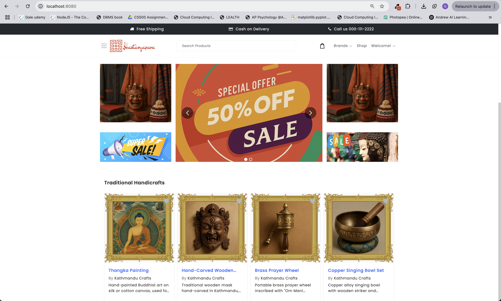
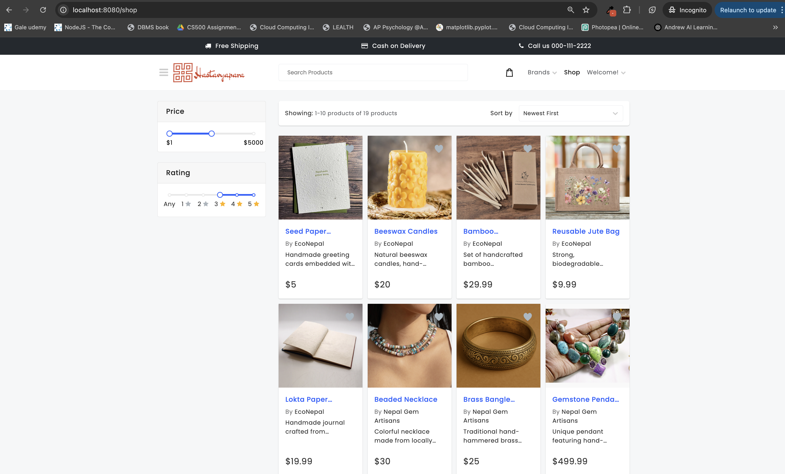
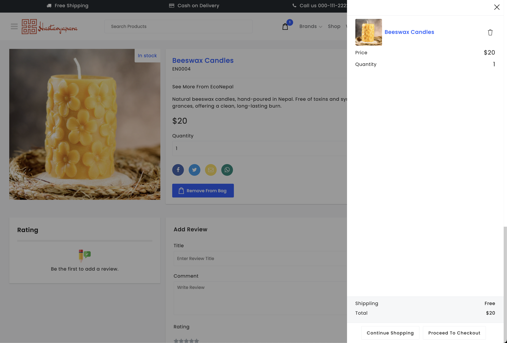
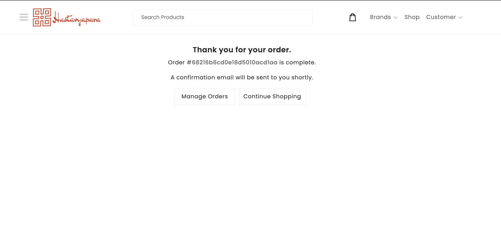

# Hastavyapara - Frontend

This is the **React + Redux Frontend** for theHastavyapara Ecommerce platform.
It allows users to browse products, categories, and brands, and provides buyers with an intuitive shopping experience.

## Project Purpose

- Customer-facing frontend for browsing & purchasing products
- Responsive UI for desktop and mobile
- State management with Redux
- Communication with backend API

## Tech Stack

- React
- Redux + Redux Thunk
- Axios
- React Router
- Tailwind CSS

## Setup Instructions

### Prerequisites

- Node.js >= 18.x
- npm >= 9.x

### Installation

1. Navigate to the `client` folder

```bash
cd client
npm install
```

2. Create a `.env` file based on `.env.example`

```env
API_URL=http://localhost:3000/api
```

3. Start the development server

```bash
npm run dev
```

Access the app at [http://localhost:8080](http://localhost:3000)

## Screenshots

homepage



Shop by category




Product detail and cart page





## Notes

- All backend API requests are made to `API_URL`
- Uses environment variables for sensitive keys
